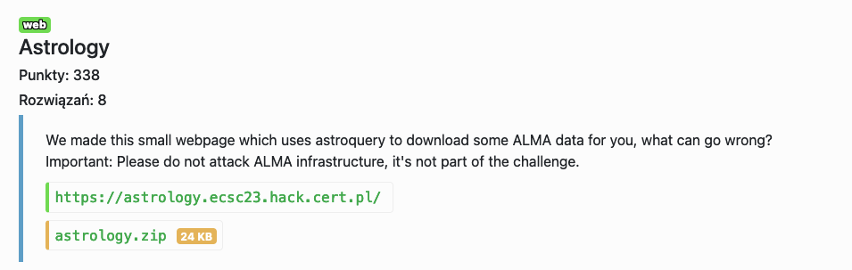
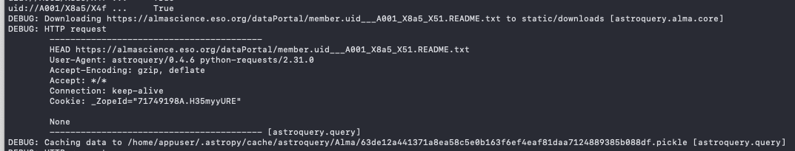
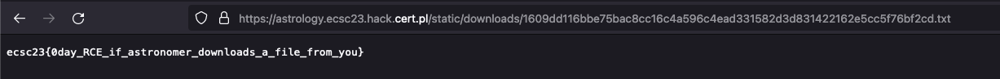

# Astrology - web

Po odpaleniu lokalnego serwera z `from astroquery import log; log.setLevel("DEBUG")` okazuje się, że przy pobieraniu plików funkcją `ALMA().download_files`, Astroquery cacheuje klasę `Request` pickleując ją:

Używając `dataarchive_url` możemy zqueryować nasze podstawione API, który odpowie, żeby pobrać malicious pickle'a do miejsca wskazanego przez `Content-Disposition` header (path traversal). Nazwa zcacheowanego response'a to tak naprawdę hash klasy `AstroQuery`.

Przy drugim query, AstroQuery spróbuje zdeserializować zcacheowany request, gdzie przez insecure deserialization możemy skopiować flagę do `/static/downloads/xxxx.txt` i stamtąd ją pobrać. 

Flag: `ecsc23{0day_RCE_if_astronomer_downloads_a_file_from_you}`
