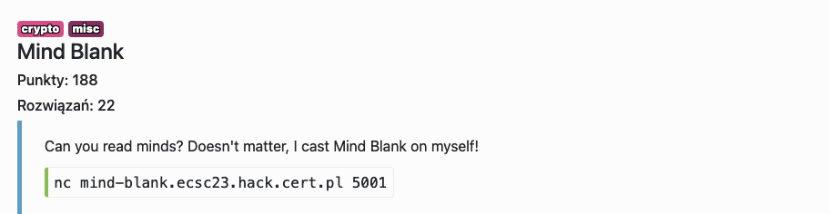

# Mind Blank - crypto, misc

Rozwiązanie polega na otworzeniu ~25 połączeń do serwera, aby `random.seed` był taki sam na wszystkich (`time.ctime` zwraca czas z resolution co do sekundy). Trzeba odgadnąć 48 pierwszych bitów, z czego 21 pierwszych to jest State LFSR, reszta to są taps, które potem możemy zbruteforceować aby dostać następne bity LFSR do odszyfrowania flagi.

Flag: `ecsc23{I_see_we_got_ourselves_a_mind_reader_here}`
