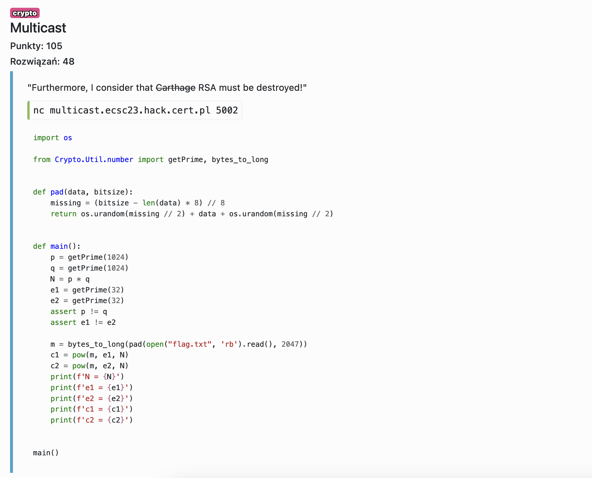

# Multicast - crypto

Używając [tego toola](https://github.com/a0xnirudh/Exploits-and-Scripts/blob/master/RSA%20Attacks/RSA:%20Common%20modulus%20attack.py) i podmieniając tam dane, dostajemy flagę.

Flag: `ecsc23{every_ctf_needs_some_rsa_breaking_challenge}`
