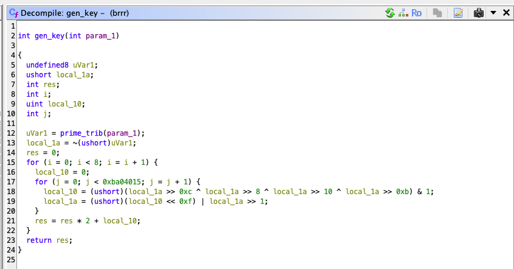

# CPU goes brrr - re

### Task

Zadanie polegało na analizie wolnego algorytmu i przyspieszeniu go.

### Solution

Analizując plik, funkcja generująca klucz xorowany z flagą wygląda tak:



Najwięcej czasu zabiera funkcja `prime_trib`, która generuje najbliższą liczbę pierwszą z algorytmu Tribonacciego.

Przepisując do Pythona i dodając trochę optymalizacji (cache, lepsza `is_prime` funkcja) skrypt generuje wszystkie klucze w <2s.

```python
from multiprocessing import Pool
from sympy import isprime
import binascii
import sys

sys.setrecursionlimit(55000)

flag_enc = binascii.unhexlify(
    "6e687808b07745006f898b04bce8c2993bdc0b434f217256c8dde3e846ed94d76f0501f4bf"
)

cache = {}
def tribonacci(n):
  if n in cache:
    return cache[n]

  if n < 2:
      return 1
  else:
    res = ((tribonacci(n - 1) & 0xFFFFFFFFFFFFFFFF) + (tribonacci(n - 2) & 0xFFFFFFFFFFFFFFFF) + (tribonacci(n - 3) & 0xFFFFFFFFFFFFFFFF)) & 0xFFFFFFFFFFFFFFFF
    cache[n] = res
    return res

def sub_1230(arg1: int) -> int:
    rax_2 = 0
    var_1c = arg1
    while True:
        rax_2 = tribonacci(var_1c)
        if isprime(rax_2):
            break

        var_1c += 1

    return rax_2

def sub_126b(i: int) -> int:
    var_1a = sub_1230(i)
    return ~var_1a & 0xffffffff


if __name__ == "__main__":
    args = [i ** 3 for i in range(len(flag_enc))]
    with Pool(5) as p:
        res = p.map(sub_126b, args)

    print(f"{res=}") # [4294967292, 4294967292, 4294967102, 4166767774, 923810610, 50867904, 1181955302, 83064966, 345609534, 3037958716, 2967652352, 1861911262, 1735161212, 2233276342, 1430256410, 2917585052, 1631478334, 2725244544, 2525184062, 586921006, 3745518478, 3610405742, 2410571558, 298081606, 1953977854, 774429788, 3403274624, 2489184302, 753143358, 2592734942, 588270332, 1869837758, 1484141034, 2565793568, 3196810006, 2097899758, 3243572348]
```

Przepisując ostatniego loopa do C++ i odpalając 6 threadów, dostajemy flagę:
`ecsc24{sl0w_4nd_5t3ady_w1ns_th3_r4ce}`