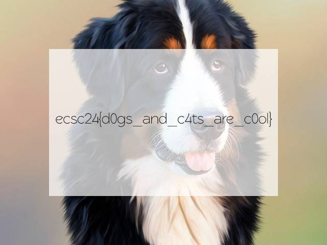

# DoggoWorld - web

### Task

Zadanie polega na wysłaniu requesta, z różnymi headerami i body, które spełniają wymagania każdego etapu.

### Solution

```
$ curl "https://doggoworld.ecsc24.hack.cert.pl/" -H "User-Agent: doggobrowser" -H "X-Forwarded-For: 127.0.0.1" -H "Accept-Language: en-US" -H "Cookie: do_you_like_dogs_and_cats=yes" -X "POST" -F "doggo=ZmxhZw==" -o flag.jpg
```



