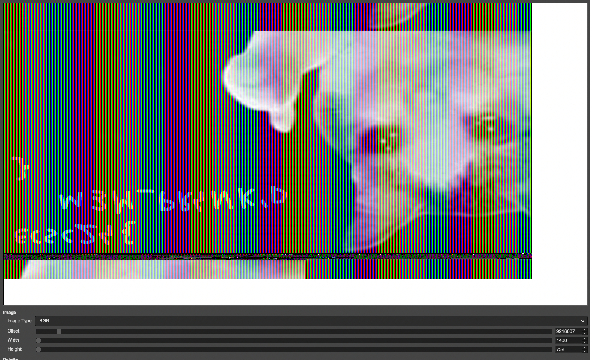

# Office Retribution - forensics

### Task

Memdump Windows'a 7 z flagą narysowaną w `mspaint.exe`

### Solution

```bash
root@vm:/home/user/volatility# python2 vol.py -f ../office.raw --profile=Win7SP1x86 pslist
Volatility Foundation Volatility Framework 2.6.1
Offset(V)  Name                    PID   PPID   Thds     Hnds   Sess  Wow64 Start                          Exit   
0x843a3a68 svchost.exe            2556    484      9      297      0      0 2024-06-10 11:35:31 UTC+0000                                 
0x8442e030 mspaint.exe            3904   1332      7      138      1      0 2024-06-10 11:35:54 UTC+0000                                 
0x84440030 svchost.exe            3928    484      6       99      0      0 2024-06-10 11:35:54 UTC+0000  
root@vm:/home/user/volatility# python2 vol.py -f ../office.raw --profile=Win7SP1x86 memdump -p 3904 -D ./dump
```

Zaimportować dump pamięci procesu w Gimpie jako `Raw image data` i znaleźć dobry offset i width:



`ecsc24{M3M_PR4NK'D}`