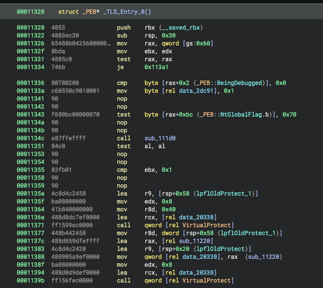
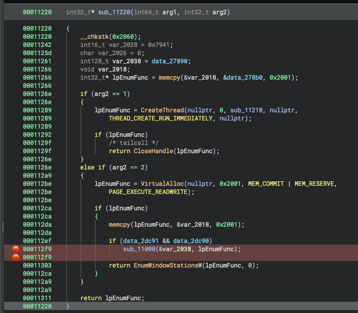
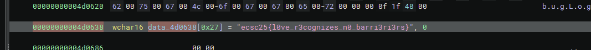

# Love letter - re

### Solution

W zadaniu dostajemy binarkę z "malwarem", która jest w dziwny sposób spakowana/zencryptowana

- Odpaliłem ją w WinDbg triggerując anti-debugging prompt (żeby proces się nie zamknął) i zdumpowałem odszyfrowaną Scyllą
- Po wczytaniu jej do dekompilera, widać że w `_TLS_Entry_0()` jest logika do wykrywania czy process jest debuggowany, odpala też funkcję `sub_11220()` jeśli nie jest
- Wypatchowałem wszystkie jumpy żeby zawsze funkcja `sub_11220()` się wykonywała (nawet jeśli proces jest debuggowany):
  
- Potem odpaliłem ją w debuggerze Binjy, breakpointując na funkcji dekrypcji (chyba RC4):
  
- Po breakpointcie (i stepie przez `*1=1`) ustawiłem RIP na adres RBX'u, który wskazywał na adres shellcode'u
- Kolejny breakpoint na instrukcje po loopie XORującym shellcode, po nim flaga była w zdecryptowanym shellcode'zie:
  
