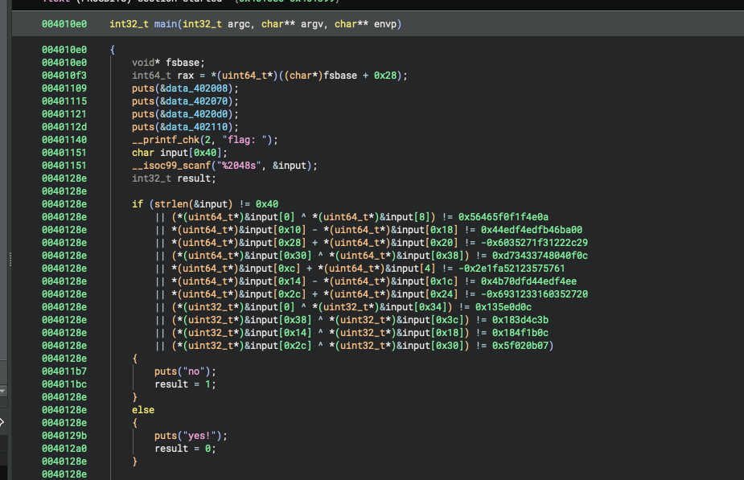

# re-crackme - re

### Solution

W zadaniu dostajemy binarkę która sprawdza input z flagą prostymi operacjami (+, -, XOR):



Wklepałem zdekompilowany kod do LLMa i poprosiłem żeby przepisał na Z3:

```python
from z3 import *

solver = Solver()
flag_bytes = [BitVec(f"byte_{i}", 8) for i in range(64)]

prefix = "ecsc25{"
for i in range(len(prefix)):
    solver.add(flag_bytes[i] == ord(prefix[i]))

solver.add(flag_bytes[63] == ord('}'))

for i in range(len(prefix), 63):
    solver.add(And(flag_bytes[i] >= 32, flag_bytes[i] <= 126))

def get_val(offset):
    return Concat([flag_bytes[offset + i] for i in range(7, -1, -1)])

def get_val32(offset):
    return Concat([flag_bytes[offset + i] for i in range(3, -1, -1)])

solver.add(get_val(0) ^ get_val(8) == 0x56465f0f1f4e0a)
solver.add(get_val(16) - get_val(24) == 0x44edf4edfb46ba00)
solver.add(get_val(40) + get_val(32) == -0x6035271f31222c29)
solver.add(get_val(48) ^ get_val(56) == 0xd73433748040f0c)
solver.add(get_val(12) + get_val(4) == -0x2e1fa52123575761)
solver.add(get_val(20) - get_val(28) == 0x4b70dfd44edf4ee)
solver.add(get_val(44) + get_val(36) == -0x6931233160352720)
solver.add(get_val32(0) ^ get_val32(52) == 0x135e0d0c)
solver.add(get_val32(56) ^ get_val32(60) == 0x183d4c3b)
solver.add(get_val32(20) ^ get_val32(24) == 0x184f1b0c)
solver.add(get_val32(44) ^ get_val32(48) == 0x5f020b07)

solver.check()

model = solver.model()
result = bytearray(64)
for i in range(64):
    result[i] = model[flag_bytes[i]].as_long()

print(result.decode()) # ecsc25{no-llms-no-techbros-just-reverse-engineering-in-peace^-^}
```
