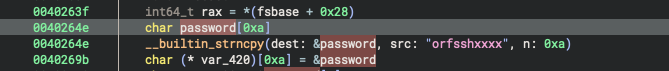
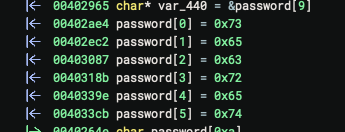

# Sneaky Train - re

### Solution

Dostajemy binarkę ze snake'iem, po ~4 zjedzonych punktów gra freezuje się i czeka na wpisanie hasła

Po dekompilacji widać że binarka kopiuje hasło do variabla i zmienia pierwsze litery hasła na "secret":

Po haśle (`secretxxx`) możemy dokończyć grę (tak długo aż długość węża nie będzie równała się długości flagi).

Flaga: `ecsc25{all_rights_reversed!!1}`